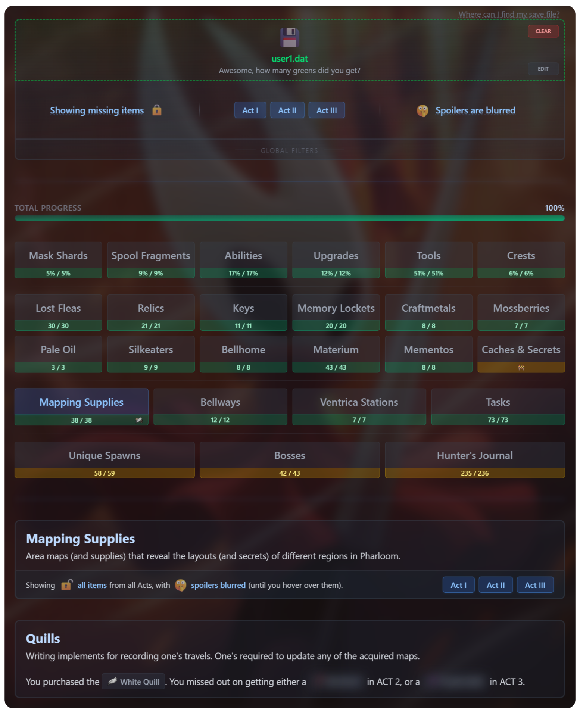

# 🧵🎵 Silksong Completionist

### Track your [Hollow Knight: Silksong](https://store.steampowered.com/app/1030300/Hollow_Knight_Silksong/) Progress

For all the completionists out there, this app helps you track your in-game progress using your save file.

## ⚙️ Usage

🔗 **Try it here:** [silksong-completionist.com](https://silksong-completionist.com/)

Simply drag and drop your save file into the upload box, or click to browse and upload it.

If you're unsure where your save file is located, click "Where can I find my save file?" above the upload area for platform-specific paths.

Once uploaded, you'll see your completion progress and detailed breakdowns of collected and missing items.

## 📊 What It Tracks

Comprehensively tracks everything that contributes to 100% completion in Hollow Knight: Silksong, as well as many additional collectibles and features.

### ✨ Core Progress (items that count towards **100% completion**)

- **Mask Shards**
- **Spool Fragments**
- **Abilities**
  - Silk Skills
  - Silk Hearts
  - Cloak Abilities _(these don't contribute to 100% completion)_
  - Ancestral Arts
  - Other (Unique) Abilities
    - Sylphsong
    - Everbloom
- **Upgrades**
  - Needle Upgrades
  - Tool Pouch Upgrades
  - Tool Kit Upgrades
- **Tools**
- **Crests**

### 💎 Collectibles & Resources

- **Lost Fleas**
- **Relics**
- **Keys**
- **Memory Lockets**
- **Craftmetals**
- **Mossberries**
- **Pale Oil**
- **Silkeaters**
- **Bellhome**
  - Furnishings & Decor
  - Devices & Fixtures
- **Materium**
- **Mementos**

### 🗺️ Exploration & Navigation

- **Mapping Supplies**
  - Quills
  - Map Pins
  - Maps
- **Bellways**
- **Ventrica Stations**
- **Tasks** (a.k.a. Quests)

### 💪 Bestiary

- **Unique Spawns**
  - Rhinogrunds
  - Covetous Pilgrims
  - Shardillards
  - Void Masses
- **Bosses**
- **Hunter's Journal**

## 🔧 Advanced Features

- **Interactive Map**: Each trackable item features a dedicated Map button that opens an interactive modal displaying the in-game map with a precise location marker, helping you navigate directly to that specific item

- **Flexible Filters**: Customize your view with completion status toggles (missing/all items), Act-specific (Act I, Act II, Act III) filters, and spoiler blur toggles

- **Save Editor**: A feature-rich editor with advanced search and real-time JSON validation for modifying save files

## 🐞 Issues & Contributions

If you spot an error or missing data:

- 🐛 **Report it**: Open an issue in this repository.
- 🛠️ **Fix it**: Submit a pull request if you’ve already solved it!

## 💖 Credits

Huge thanks to everyone who helped make this possible!

- 💡 _Inspired_ by the legendary [Hollow Knight Completion Check](https://reznormichael.github.io/hollow-knight-completion-check/) _(RIP)_
- 🔍 _Savegame decipher code_ from [martinshift/silksaver](https://martinshift.github.io/silksaver/)
- 🧠 _Code & data contributions_ from [@theezeb](https://github.com/theezeb), [@btastic](https://github.com/btastic), [@TheSaneWriter](https://github.com/TheSaneWriter), [@saiki-k](https://github.com/saiki-k)
- 📜 _100% Completion criteria reference_ from [this awesome Reddit thread](https://www.reddit.com/r/Silksong/comments/1ng54do/list_of_requirements_to_get_100_completion/)
